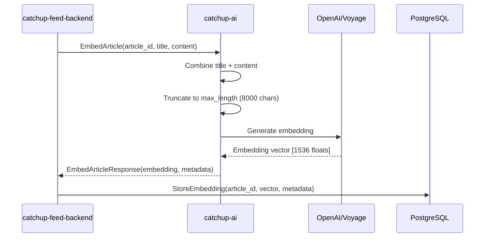
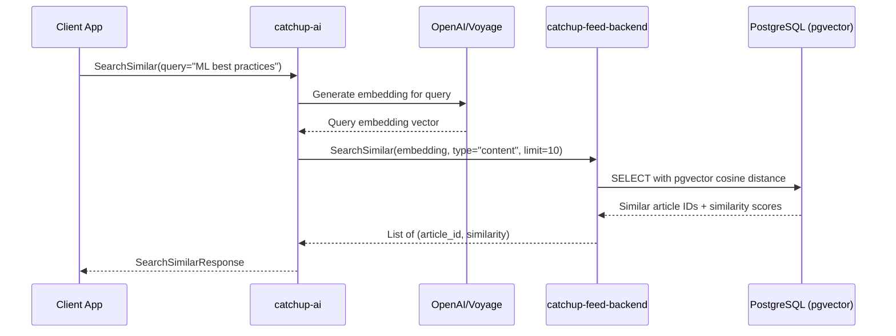

# Functional Design Specification

**Project**: catchup-ai
**Version**: 0.1.0
**Last Updated**: 2026-01-23
**Status**: Active Development (Week 1-2 Complete)

## Table of Contents

1. [Overview](#overview)
2. [Feature Inventory](#feature-inventory)
3. [Feature Specifications](#feature-specifications)
   - [F001: Article Embedding Generation](#f001-article-embedding-generation)
   - [F002: Similarity Search](#f002-similarity-search)
   - [F003: RAG-based Question Answering](#f003-rag-based-question-answering)
   - [F004: Weekly Summary Generation](#f004-weekly-summary-generation)
   - [F005: Article Classification](#f005-article-classification)
4. [gRPC API Specifications](#grpc-api-specifications)
5. [Data Models](#data-models)
6. [Business Logic](#business-logic)
7. [Error Handling](#error-handling)
8. [Security & Validation](#security--validation)
9. [Testing Strategy](#testing-strategy)

---

## Overview

**catchup-ai** is a specialized AI service within the catchup-feed ecosystem that provides:
- Embedding generation for article content (using OpenAI or Voyage AI)
- Similarity search capabilities
- RAG-based question answering (planned)
- Content summarization (planned)
- Article classification (planned)

### Architecture Context

```
┌─────────────────────────┐
│  catchup-feed-backend   │
│  (Go, PostgreSQL)       │
│  Port: 50052            │
└──────────┬──────────────┘
           │
           │ gRPC (EmbeddingService)
           │ - StoreEmbedding
           │ - SearchSimilar
           ↓
┌──────────┴──────────────┐
│     catchup-ai          │
│  (Python, AI Service)   │
│  Port: 50051            │
│                         │
│  ┌──────────────────┐   │
│  │ ArticleAI        │   │
│  │ Service          │   │
│  └────────┬─────────┘   │
│           │             │
│  ┌────────┴─────────┐   │
│  │ EmbeddingService │   │
│  │ (Strategy)       │   │
│  └────┬─────────┬───┘   │
│       │         │       │
│  ┌────┴───┐ ┌──┴────┐  │
│  │ OpenAI │ │Voyage │  │
│  │Adapter │ │Adapter│  │
│  └────────┘ └───────┘  │
└─────────────────────────┘
```

### Key Design Principles

1. **Separation of Concerns**: AI service handles embedding generation, backend handles storage
2. **Provider Abstraction**: Strategy pattern allows switching between OpenAI and Voyage AI
3. **Stateless**: No database, all state stored in catchup-feed-backend
4. **gRPC First**: Binary protocol for efficient inter-service communication
5. **Retry Logic**: Built-in resilience with exponential backoff

---

## Feature Inventory

| Feature ID | Feature Name | Status | Priority | Week |
|------------|--------------|--------|----------|------|
| F001 | Article Embedding Generation | ✅ Implemented | P0 | 1-2 |
| F002 | Similarity Search | ✅ Implemented | P0 | 1-2 |
| F003 | RAG-based Question Answering | 🔄 Planned | P1 | 5-6 |
| F004 | Weekly Summary Generation | 🔄 Planned | P1 | 5-6 |
| F005 | Article Classification | 🔄 Planned | P2 | 7-8 |

**Legend**:
- ✅ Implemented
- 🔄 Planned
- 🚧 In Progress
- ❌ Deprecated

---

## Feature Specifications

### F001: Article Embedding Generation

#### Purpose
Generate semantic embedding vectors for article content, enabling similarity search and RAG operations.

#### User Stories
- **US-F001-01**: As a backend service, I want to generate embeddings for newly scraped articles so that users can find similar content.
- **US-F001-02**: As a system, I want to support multiple embedding providers (OpenAI, Voyage) so that I can optimize for quality and cost.
- **US-F001-03**: As a developer, I want batch embedding support so that I can process multiple articles efficiently.

#### API Design

**gRPC Method**: `ArticleAI.EmbedArticle`

**Request Message**:
```protobuf
message EmbedArticleRequest {
  int64 article_id = 1;          // Required: Article ID from backend
  string title = 2;               // Required: Article title
  string content = 3;             // Required: Article content (may be truncated)
  string url = 4;                 // Optional: Article URL for reference
  string embedding_type = 5;      // Optional: "title", "content", "summary" (default: "content")
}
```

**Response Message**:
```protobuf
message EmbedArticleResponse {
  int64 article_id = 1;           // Article ID
  bool success = 2;               // Whether embedding succeeded
  string error_message = 3;       // Error message if failed
  int32 embedding_dimension = 4;  // Vector dimension (e.g., 1536, 1024)
  repeated float embedding = 5;   // The embedding vector
  string provider = 6;            // "openai" or "voyage"
  string model = 7;               // Model name (e.g., "text-embedding-3-small")
  string embedding_type = 8;      // Type of content embedded
}
```

**Example Request**:
```python
request = EmbedArticleRequest(
    article_id=123,
    title="Understanding Vector Embeddings",
    content="Vector embeddings are numerical representations...",
    url="https://example.com/article/123",
    embedding_type="content"
)
```

**Example Response**:
```python
response = EmbedArticleResponse(
    article_id=123,
    success=True,
    embedding_dimension=1536,
    embedding=[0.123, -0.456, 0.789, ...],  # 1536 floats
    provider="openai",
    model="text-embedding-3-small",
    embedding_type="content"
)
```

#### Data Flow



#### Business Logic

**1. Text Preparation** (`ArticleEmbeddingInput.to_text()`):
```python
def to_text(self, max_length: int = 8000) -> str:
    """
    Combines title and content for richer semantic representation.
    Format: "Title: {title}\n\nContent: {content}"

    Truncation strategy:
    - If combined text > max_length:
      - Keep full title (more important for semantics)
      - Truncate content to fit
      - Append "..." to indicate truncation
    """
    combined = f"Title: {self.title}\n\nContent: {self.content}"
    if len(combined) > max_length:
        title_part = f"Title: {self.title}\n\nContent: "
        remaining = max_length - len(title_part)
        combined = title_part + self.content[:remaining] + "..."
    return combined
```

**2. Provider Selection** (Factory Pattern):
```python
# Configuration-driven selection
provider = settings.embedding.provider  # From EMBEDDING_PROVIDER env var

if provider == "openai":
    service = OpenAIEmbeddingAdapter()
elif provider == "voyage":
    service = VoyageEmbeddingAdapter()
```

**3. Retry Strategy** (Exponential Backoff with Jitter):
```python
def _calculate_retry_delay(attempt: int) -> float:
    """
    Exponential backoff with jitter to prevent thundering herd.

    Formula: min(2^attempt, 30) * random(0.5, 1.5)

    Attempt 0: 1-1.5 seconds
    Attempt 1: 2-3 seconds
    Attempt 2: 4-6 seconds
    Max delay: 30 seconds
    """
    base_delay = 2 ** attempt
    max_delay = 30.0
    delay = min(base_delay, max_delay)
    return delay * random.uniform(0.5, 1.5)
```

**4. Batch Processing**:
```python
# OpenAI: Up to 2048 texts per request
# Voyage: Up to 128 texts per request
def embed_texts(self, texts: list[str]) -> list[EmbeddingResult]:
    batch_size = 2048 if provider == "openai" else 128
    results = []
    for i in range(0, len(texts), batch_size):
        batch = texts[i:i + batch_size]
        results.extend(self._embed_with_retry(batch))
    return results
```

#### Error Handling

| Error Type | Status | Retry? | Action |
|------------|--------|--------|--------|
| `RateLimitError` | RESOURCE_EXHAUSTED | Yes | Exponential backoff, 3 attempts |
| `TokenLimitError` | INVALID_ARGUMENT | No | Truncate text, return error |
| `API Connection Error` | UNAVAILABLE | Yes | Exponential backoff, 3 attempts |
| `Invalid API Key` | UNAUTHENTICATED | No | Return error immediately |
| `Model Not Found` | NOT_FOUND | No | Return error immediately |

**Error Response Example**:
```python
EmbedArticleResponse(
    article_id=123,
    success=False,
    error_message="Rate limit exceeded. Retry after: 5.2s"
)
```

#### Configuration

**Environment Variables**:
```bash
# Provider selection
EMBEDDING_PROVIDER=openai  # or "voyage"

# OpenAI settings
OPENAI_API_KEY=sk-...
OPENAI_EMBEDDING_MODEL=text-embedding-3-small  # 1536 dimensions
OPENAI_EMBEDDING_DIMENSION=1536

# Voyage AI settings
VOYAGE_API_KEY=pa-...
VOYAGE_EMBEDDING_MODEL=voyage-3  # 1024 dimensions
VOYAGE_EMBEDDING_DIMENSION=1024
```

**Model Comparison**:

| Provider | Model | Dimensions | Cost (per 1M tokens) | Performance |
|----------|-------|------------|---------------------|-------------|
| OpenAI | text-embedding-3-small | 1536 | $0.02 | Good |
| OpenAI | text-embedding-3-large | 3072 | $0.13 | Excellent |
| Voyage | voyage-3 | 1024 | $0.02 | Excellent (Anthropic recommended) |
| Voyage | voyage-3-lite | 512 | $0.01 | Good |

#### Security & Validation

**Input Validation**:
- `article_id` must be positive integer
- `title` must not be empty
- `content` must not be empty
- `embedding_type` must be in ["title", "content", "summary"]

**API Key Security**:
- Keys stored in environment variables (never in code)
- OpenAI keys must start with `sk-`
- Voyage keys must start with `pa-`
- Validated at application startup

#### Testing Requirements

**Unit Tests**:
- ✅ Test text truncation logic
- ✅ Test provider factory selection
- ✅ Test retry delay calculation
- ✅ Mock API responses

**Integration Tests**:
- ✅ Test real OpenAI API call (with test key)
- ✅ Test real Voyage API call (with test key)
- ✅ Test batch processing
- ✅ Test error handling and retries

**Performance Tests**:
- Single embedding: < 500ms
- Batch of 100 articles: < 10s (OpenAI), < 20s (Voyage)
- Memory usage: < 500MB for batch of 1000

---

### F002: Similarity Search

#### Purpose
Find articles semantically similar to a text query by comparing embedding vectors.

#### User Stories
- **US-F002-01**: As a user, I want to search for articles similar to my text query so that I can discover related content.
- **US-F002-02**: As a user, I want to find articles similar to an article I'm reading so that I can explore related topics.
- **US-F002-03**: As a system, I want to filter results by minimum similarity threshold so that only relevant articles are returned.

#### API Design

**gRPC Method**: `ArticleAI.SearchSimilar`

**Request Message**:
```protobuf
message SearchSimilarRequest {
  oneof search_by {
    string query = 1;         // Search by text query
    int64 article_id = 2;     // Search by article ID
  }
  int32 limit = 3;            // Max results (default: 10, max: 100)
  float min_similarity = 4;   // Minimum similarity threshold (0.0-1.0)
}
```

**Response Message**:
```protobuf
message SearchSimilarResponse {
  repeated SimilarArticle articles = 1;
}

message SimilarArticle {
  int64 article_id = 1;       // Article ID
  string title = 2;           // Article title (currently empty - see limitations)
  string url = 3;             // Article URL (currently empty)
  float similarity_score = 4; // Cosine similarity (0.0-1.0)
  string snippet = 5;         // Content snippet (currently empty)
}
```

**Example Request**:
```python
request = SearchSimilarRequest(
    query="machine learning best practices",
    limit=10,
    min_similarity=0.7
)
```

**Example Response**:
```python
response = SearchSimilarResponse(
    articles=[
        SimilarArticle(
            article_id=456,
            similarity_score=0.89
        ),
        SimilarArticle(
            article_id=789,
            similarity_score=0.85
        ),
        # ... more results
    ]
)
```

#### Data Flow



#### Business Logic

**1. Query Embedding**:
```python
# Convert text query to embedding vector
embedding_result = embedding_service.embed_text(request.query)
query_vector = embedding_result.vector  # e.g., 1536 floats
```

**2. Backend Search Call**:
```python
# Call backend's EmbeddingService.SearchSimilar
results = embedding_client.search_similar(
    embedding=list(query_vector),
    embedding_type="content",  # Search against content embeddings
    limit=request.limit if request.limit > 0 else 10
)
```

**3. Similarity Calculation** (performed by backend using pgvector):
```sql
-- Backend SQL query (for reference)
SELECT
    article_id,
    1 - (embedding <=> $1::vector) as similarity
FROM article_embeddings
WHERE embedding_type = $2
ORDER BY embedding <=> $1::vector
LIMIT $3;
```

**Similarity Score Interpretation**:
- `1.0`: Identical content
- `0.9-0.99`: Very similar
- `0.8-0.89`: Similar
- `0.7-0.79`: Somewhat similar
- `< 0.7`: Different content

#### Current Limitations

**Search by Article ID Not Yet Implemented**:
```python
if request.HasField("article_id"):
    context.set_code(grpc.StatusCode.UNIMPLEMENTED)
    context.set_details(
        "Search by article_id not yet implemented. "
        "Use query text instead."
    )
    return SearchSimilarResponse()
```

**Missing Article Metadata**:
The current implementation only returns `article_id` and `similarity_score`. The `title`, `url`, and `snippet` fields are empty because the backend's `SearchSimilar` RPC only returns IDs and scores.

**Workaround**: Clients must make a separate call to the backend to fetch article details:
```python
# 1. Get similar article IDs
similar_articles = ai_service.SearchSimilar(query="ML")

# 2. Fetch article details from backend
for article in similar_articles:
    details = backend_service.GetArticle(article.article_id)
    print(f"{details.title}: {article.similarity_score}")
```

#### Error Handling

| Error Type | gRPC Status | Action |
|------------|-------------|--------|
| Empty query and no article_id | INVALID_ARGUMENT | Return error |
| Embedding generation failed | INTERNAL | Return empty results |
| Backend connection failed | UNAVAILABLE | Return empty results |
| Backend timeout | DEADLINE_EXCEEDED | Return empty results |

#### Configuration

**Backend Connection Settings**:
```bash
BACKEND_GRPC_HOST=localhost
BACKEND_GRPC_PORT=50052
BACKEND_GRPC_TIMEOUT=30.0  # seconds
```

#### Testing Requirements

**Unit Tests**:
- ✅ Test query embedding generation
- ✅ Test backend client call
- ✅ Test result mapping
- ✅ Test error handling

**Integration Tests**:
- Test end-to-end search with real backend
- Test with various similarity thresholds
- Test with large result sets (limit=100)
- Test timeout handling

---

### F003: RAG-based Question Answering

#### Status
🔄 **Planned for Week 5-6**

#### Purpose
Answer user questions using Retrieval-Augmented Generation (RAG) over article content.

#### User Stories
- **US-F003-01**: As a user, I want to ask natural language questions so that I can get answers from my article collection.
- **US-F003-02**: As a user, I want to see which articles were used to generate the answer so that I can verify information.
- **US-F003-03**: As a user, I want to filter articles by date and category so that answers are contextually relevant.

#### API Design (Planned)

**gRPC Method**: `ArticleAI.QueryArticles`

**Request Message**:
```protobuf
message QueryArticlesRequest {
  string question = 1;                // User's question
  int32 max_context_articles = 2;     // Max articles for context (default: 5)
  DateRange date_range = 3;           // Optional: filter by date
  repeated string categories = 4;     // Optional: filter by category
}

message DateRange {
  string start_date = 1;              // RFC3339 format
  string end_date = 2;                // RFC3339 format
}
```

**Response Message**:
```protobuf
message QueryArticlesResponse {
  string answer = 1;                  // Generated answer
  repeated SourceArticle source_articles = 2;  // Context articles used
  float confidence = 3;               // Confidence score (0.0-1.0)
}

message SourceArticle {
  int64 article_id = 1;
  string title = 2;
  string url = 3;
  float relevance_score = 4;
}
```

#### Planned Implementation

**RAG Pipeline**:
1. **Retrieval Phase**:
   - Embed user question
   - Search for top-N similar articles (e.g., N=10)
   - Apply date/category filters
   - Select top-K most relevant (e.g., K=5)

2. **Augmentation Phase**:
   - Extract relevant snippets from articles
   - Construct context window
   - Format as prompt with sources

3. **Generation Phase**:
   - Call LLM (GPT-4o-mini) with context
   - Generate answer with citations
   - Calculate confidence score

**Prompt Template** (planned):
```
You are a helpful assistant that answers questions based on provided articles.

Context Articles:
[1] {article_1_title}
{article_1_snippet}

[2] {article_2_title}
{article_2_snippet}

...

Question: {user_question}

Please provide a comprehensive answer based only on the context above. Cite sources using [1], [2], etc.
```

#### Testing Requirements (Planned)
- Test retrieval accuracy
- Test answer quality (manual evaluation)
- Test citation correctness
- Test edge cases (no relevant articles, ambiguous questions)

---

### F004: Weekly Summary Generation

#### Status
🔄 **Planned for Week 5-6**

#### Purpose
Generate automated summaries of articles for a given time period.

#### User Stories
- **US-F004-01**: As a user, I want to receive a weekly summary of articles so that I can quickly catch up on important content.
- **US-F004-02**: As a user, I want to filter summaries by topic so that I focus on areas of interest.
- **US-F004-03**: As a user, I want to see key highlights so that I can identify trending topics.

#### API Design (Planned)

**gRPC Method**: `ArticleAI.GenerateWeeklySummary`

**Request Message**:
```protobuf
message GenerateWeeklySummaryRequest {
  string period = 1;                  // "week", "month"
  DateRange date_range = 2;           // Optional: specific date range
  repeated string topics = 3;         // Optional: filter by topic
  int32 max_length = 4;               // Max summary length (chars)
}
```

**Response Message**:
```protobuf
message GenerateWeeklySummaryResponse {
  string summary = 1;                 // Generated summary
  repeated string highlights = 2;     // Key highlights
  repeated SummaryArticle articles = 3;  // Articles included
  DateRange covered_period = 4;       // Period covered
}

message SummaryArticle {
  int64 article_id = 1;
  string title = 2;
  string url = 3;
  string category = 4;
}
```

#### Planned Implementation

**Summary Generation Pipeline**:
1. Fetch articles for time period
2. Group by topic/category
3. Extract key points from each article
4. Generate cohesive summary using LLM
5. Identify top highlights
6. Format output with citations

---

### F005: Article Classification

#### Status
🔄 **Planned for Week 7-8**

#### Purpose
Automatically categorize articles into predefined categories (e.g., AI, Web, Infrastructure, Security).

#### User Stories
- **US-F005-01**: As a system, I want to automatically classify articles so that users can filter by category.
- **US-F005-02**: As a user, I want to see confidence scores so that I can understand classification reliability.
- **US-F005-03**: As an admin, I want to fine-tune the classifier so that accuracy improves over time.

#### API Design (Planned)

**gRPC Method**: `ArticleAI.ClassifyArticle`

**Request Message**:
```protobuf
message ClassifyArticleRequest {
  int64 article_id = 1;               // Optional: if already stored
  string title = 2;                   // Required
  string content = 3;                 // Required
}
```

**Response Message**:
```protobuf
message ClassifyArticleResponse {
  string category = 1;                // Primary category
  float confidence = 2;               // Confidence score (0.0-1.0)
  repeated CategoryScore all_scores = 3;  // All category scores
}

message CategoryScore {
  string category = 1;                // e.g., "AI", "Web", "Infrastructure"
  float score = 2;
}
```

#### Planned Implementation

**Classification Approaches** (to be evaluated):
1. **Zero-shot Classification**: Use LLM to classify without training
2. **Few-shot Classification**: Provide examples in prompt
3. **Fine-tuned Model**: Fine-tune smaller model on labeled data

**Predefined Categories** (subject to change):
- AI/ML
- Web Development
- Infrastructure/DevOps
- Security
- Mobile
- Data Engineering
- Other

---

## gRPC API Specifications

### Service Definition

**File**: `proto/article.proto`

```protobuf
syntax = "proto3";

package catchup.ai.v1;

option go_package = "github.com/tsuchiya-yu2/catchup-feed-backend/proto/catchup/ai/v1";

service ArticleAI {
  rpc EmbedArticle(EmbedArticleRequest) returns (EmbedArticleResponse);
  rpc SearchSimilar(SearchSimilarRequest) returns (SearchSimilarResponse);
  rpc QueryArticles(QueryArticlesRequest) returns (QueryArticlesResponse);
  rpc GenerateWeeklySummary(GenerateWeeklySummaryRequest) returns (GenerateWeeklySummaryResponse);
  rpc ClassifyArticle(ClassifyArticleRequest) returns (ClassifyArticleResponse);
}
```

### Backend Embedding Service (Client)

**File**: `proto/embedding/embedding.proto`

```protobuf
syntax = "proto3";

package embedding;

option go_package = "catchup-feed/internal/interface/grpc/pb/embedding";

service EmbeddingService {
  rpc StoreEmbedding(StoreEmbeddingRequest) returns (StoreEmbeddingResponse);
  rpc GetEmbeddings(GetEmbeddingsRequest) returns (GetEmbeddingsResponse);
  rpc SearchSimilar(SearchSimilarRequest) returns (SearchSimilarResponse);
  rpc DeleteEmbedding(DeleteEmbeddingRequest) returns (DeleteEmbeddingResponse);
}
```

### Server Configuration

**Host**: `0.0.0.0`
**Port**: `50051`
**Max Workers**: `10` (configurable)
**Max Message Size**: `100 MB`
**Health Check**: `grpc.health.v1.Health` service enabled

### Connection Settings

**Timeout**: `120 seconds` (default)
**Retry**: Handled by client
**Protocol**: HTTP/2
**TLS**: Not enabled (internal service)

---

## Data Models

### Core Domain Models

#### EmbeddingResult

```python
@dataclass(frozen=True)
class EmbeddingResult:
    """Result of an embedding operation.

    This is the internal representation used by embedding adapters.
    """
    vector: list[float]       # Embedding vector
    model: str                # Model name (e.g., "text-embedding-3-small")
    provider: str             # Provider ("openai" or "voyage")
    tokens_used: int          # Number of tokens processed

    @property
    def dimension(self) -> int:
        """Get the dimension of the embedding vector."""
        return len(self.vector)
```

#### ArticleEmbeddingInput

```python
@dataclass(frozen=True)
class ArticleEmbeddingInput:
    """Input for embedding an article.

    Combines title and content for richer semantic representation.
    """
    article_id: int
    title: str
    content: str
    url: str | None = None

    def to_text(self, max_length: int = 8000) -> str:
        """Convert to text for embedding with intelligent truncation."""
        combined = f"Title: {self.title}\n\nContent: {self.content}"
        if len(combined) > max_length:
            title_part = f"Title: {self.title}\n\nContent: "
            remaining = max_length - len(title_part)
            combined = title_part + self.content[:remaining] + "..."
        return combined
```

#### SimilarArticleResult

```python
@dataclass
class SimilarArticleResult:
    """Result of similarity search."""
    article_id: int
    similarity: float         # Cosine similarity (0.0-1.0)
```

### Configuration Models

#### Settings

```python
class Settings(BaseSettings):
    """Main application settings loaded from environment."""
    environment: str          # "development" or "production"
    debug: bool               # Debug mode flag
    log_level: str            # "DEBUG", "INFO", "WARNING", "ERROR"

    # Nested settings
    embedding: EmbeddingSettings
    openai: OpenAISettings
    voyage: VoyageSettings
    grpc: GrpcSettings
    backend: BackendSettings
```

#### EmbeddingSettings

```python
class EmbeddingSettings(BaseSettings):
    """Embedding service configuration."""
    provider: EmbeddingProvider  # "openai" or "voyage"
    dimension: int                # Embedding dimension
```

#### OpenAISettings

```python
class OpenAISettings(BaseSettings):
    """OpenAI API configuration."""
    api_key: str                      # sk-...
    embedding_model: str              # "text-embedding-3-small"
    embedding_dimension: int          # 1536
    chat_model: str                   # "gpt-4o-mini" (for RAG)
```

#### VoyageSettings

```python
class VoyageSettings(BaseSettings):
    """Voyage AI API configuration."""
    api_key: str                      # pa-...
    embedding_model: str              # "voyage-3"
    embedding_dimension: int          # 1024
```

---

## Business Logic

### Embedding Service Interface

```python
class EmbeddingService(ABC):
    """Abstract base class for embedding services.

    Implementations: OpenAIEmbeddingAdapter, VoyageEmbeddingAdapter
    """

    @abstractmethod
    def embed_text(self, text: str) -> EmbeddingResult:
        """Generate embedding for a single text."""
        pass

    @abstractmethod
    def embed_texts(self, texts: list[str]) -> list[EmbeddingResult]:
        """Generate embeddings for multiple texts (batch)."""
        pass

    def embed_article(self, article: ArticleEmbeddingInput) -> EmbeddingResult:
        """Generate embedding for an article."""
        text = article.to_text()
        return self.embed_text(text)

    def embed_articles(self, articles: list[ArticleEmbeddingInput]) -> list[EmbeddingResult]:
        """Generate embeddings for multiple articles (batch)."""
        texts = [article.to_text() for article in articles]
        return self.embed_texts(texts)
```

### OpenAI Adapter Implementation

**Key Features**:
- Uses `openai` Python SDK
- Supports batch processing (up to 2048 texts)
- Exponential backoff with jitter for retries
- Rate limit handling

**Token Usage Calculation**:
```python
# OpenAI returns total tokens for the batch
# Divide by number of texts for per-text estimate
tokens_per_text = response.usage.total_tokens // len(texts)
```

### Voyage AI Adapter Implementation

**Key Features**:
- Uses `httpx` for HTTP requests
- Supports batch processing (up to 128 texts)
- Compatible API design (similar to OpenAI)
- Anthropic recommended provider

**API Endpoint**:
```
POST https://api.voyageai.com/v1/embeddings
Authorization: Bearer {api_key}
Content-Type: application/json

{
  "input": ["text1", "text2", ...],
  "model": "voyage-3"
}
```

### Factory Pattern

```python
def create_embedding_service(
    provider: str | EmbeddingProvider | None = None,
) -> EmbeddingService:
    """Create embedding service based on configuration.

    This implements the Strategy Pattern, allowing runtime selection
    of embedding provider based on EMBEDDING_PROVIDER env var.
    """
    settings = get_settings()
    provider = provider or settings.embedding.provider

    if provider == EmbeddingProvider.OPENAI:
        return OpenAIEmbeddingAdapter()
    elif provider == EmbeddingProvider.VOYAGE:
        return VoyageEmbeddingAdapter()
    else:
        raise ValueError(f"Unsupported provider: {provider}")
```

---

## Error Handling

### Exception Hierarchy

```python
class EmbeddingError(Exception):
    """Base exception for embedding errors."""
    pass

class RateLimitError(EmbeddingError):
    """Raised when API rate limit is exceeded."""
    def __init__(self, retry_after: float | None = None):
        self.retry_after = retry_after
        super().__init__(f"Rate limit exceeded. Retry after: {retry_after}s")

class TokenLimitError(EmbeddingError):
    """Raised when text exceeds token limit."""
    def __init__(self, tokens: int, limit: int):
        self.tokens = tokens
        self.limit = limit
        super().__init__(f"Token limit exceeded: {tokens} > {limit}")
```

### Retry Strategy

**Max Retries**: 3 attempts
**Delay Calculation**: Exponential backoff with jitter
**Retryable Errors**: Rate limits, connection errors, timeouts
**Non-retryable Errors**: Invalid API key, invalid arguments, not found

```python
def _embed_with_retry(self, texts: list[str]) -> list[EmbeddingResult]:
    max_retries = 3
    for attempt in range(max_retries):
        try:
            return self._call_api(texts)
        except OpenAIRateLimitError as e:
            if attempt == max_retries - 1:
                raise RateLimitError() from e
            delay = self._calculate_retry_delay(attempt)
            logger.warning("Rate limited, retrying", attempt=attempt + 1, delay=delay)
            time.sleep(delay)
        except Exception as e:
            if attempt == max_retries - 1:
                raise EmbeddingError(f"Failed after {max_retries} attempts: {e}") from e
            delay = self._calculate_retry_delay(attempt)
            logger.warning("API error, retrying", attempt=attempt + 1, delay=delay, error=str(e))
            time.sleep(delay)
```

### gRPC Error Mapping

| Python Exception | gRPC Status Code | Client Action |
|------------------|------------------|---------------|
| `RateLimitError` | RESOURCE_EXHAUSTED | Retry with backoff |
| `TokenLimitError` | INVALID_ARGUMENT | Truncate text |
| `EmbeddingError` | INTERNAL | Log error, return failure |
| `ConnectionError` | UNAVAILABLE | Retry connection |
| `TimeoutError` | DEADLINE_EXCEEDED | Increase timeout |
| `grpc.RpcError` | (various) | Handle based on code |

### Logging Strategy

**Log Level Guidelines**:
- `DEBUG`: API call details, token counts
- `INFO`: Successful operations, service startup
- `WARNING`: Retries, rate limits, non-critical errors
- `ERROR`: Failed operations, critical errors

**Structured Logging** (using `structlog`):
```python
logger.info(
    "Embeddings generated",
    count=len(results),
    total_tokens=response.usage.total_tokens,
    provider="openai",
    model="text-embedding-3-small"
)
```

---

## Security & Validation

### API Key Management

**Storage**:
- All API keys stored in environment variables
- Never committed to version control
- Loaded from `.env` file in development
- Injected via Docker environment in production

**Validation** (at startup):
```python
@field_validator("api_key")
@classmethod
def validate_api_key(cls, v: str) -> str:
    if v and not v.startswith("sk-"):  # OpenAI
        raise ValueError("Invalid OpenAI API key format")
    return v
```

### Input Validation

**Article ID**:
- Must be positive integer (`> 0`)
- Validated at gRPC layer

**Text Content**:
- Must not be empty
- Automatically truncated to max length (8000 chars)

**Embedding Type**:
- Must be one of: `["title", "content", "summary"]`
- Default: `"content"`

### Rate Limiting

**Provider Limits**:
- **OpenAI**: 60,000 tokens/minute (varies by tier)
- **Voyage**: 1,000 requests/minute (varies by plan)

**Handling**:
- Exponential backoff with jitter
- Max 3 retry attempts
- Return `RateLimitError` if all retries fail

### Network Security

**gRPC Transport**:
- Currently: Insecure (internal service)
- Production: TLS should be enabled
- Authentication: Mutual TLS recommended

**Backend Communication**:
- Internal network only
- No public internet exposure
- Connection timeout: 30 seconds

---

## Testing Strategy

### Unit Tests

**Coverage Target**: > 80%

**Test Categories**:
1. **Data Models**:
   - Test `ArticleEmbeddingInput.to_text()` with various lengths
   - Test truncation logic
   - Test edge cases (empty strings, very long texts)

2. **Embedding Service**:
   - Mock provider API calls
   - Test retry logic
   - Test error handling
   - Test batch processing

3. **Factory Pattern**:
   - Test provider selection
   - Test configuration loading
   - Test invalid provider handling

**Example Test**:
```python
def test_article_to_text_truncation():
    """Test that long content is properly truncated."""
    article = ArticleEmbeddingInput(
        article_id=1,
        title="Short Title",
        content="x" * 10000  # Very long content
    )
    text = article.to_text(max_length=1000)
    assert len(text) <= 1000
    assert text.startswith("Title: Short Title")
    assert text.endswith("...")
```

### Integration Tests

**Test Scenarios**:
1. **End-to-End Embedding**:
   - Call `EmbedArticle` with real article data
   - Verify embedding dimensions
   - Verify provider metadata

2. **Backend Communication**:
   - Call `SearchSimilar` with backend running
   - Verify results format
   - Test timeout handling

3. **Provider Switching**:
   - Test with OpenAI provider
   - Test with Voyage provider
   - Verify results are comparable

**Test Environment**:
- Use test API keys (rate-limited, free tier)
- Mock backend service for isolated tests
- Use Docker Compose for full integration

### Performance Tests

**Benchmarks**:
1. **Single Embedding**: < 500ms
2. **Batch of 10**: < 2 seconds
3. **Batch of 100**: < 10 seconds

**Load Testing**:
- Concurrent requests: 10 simultaneous clients
- Throughput: > 100 embeddings/minute
- Memory usage: < 500MB under load

### Manual Testing

**Test Cases**:
1. Start service with `docker compose up`
2. Call `EmbedArticle` with sample article
3. Verify embedding stored in backend
4. Call `SearchSimilar` with query
5. Verify similar articles returned

**Health Check**:
```bash
grpcurl -plaintext localhost:50051 grpc.health.v1.Health/Check
```

---

## Appendices

### A. Embedding Model Specifications

#### OpenAI text-embedding-3-small
- **Dimensions**: 1536
- **Max Input Tokens**: 8191
- **Cost**: $0.02 per 1M tokens
- **Latency**: ~200ms per request
- **Use Case**: General purpose, cost-effective

#### OpenAI text-embedding-3-large
- **Dimensions**: 3072
- **Max Input Tokens**: 8191
- **Cost**: $0.13 per 1M tokens
- **Latency**: ~300ms per request
- **Use Case**: High accuracy required

#### Voyage voyage-3
- **Dimensions**: 1024
- **Max Input Tokens**: 32000
- **Cost**: $0.02 per 1M tokens
- **Latency**: ~250ms per request
- **Use Case**: Anthropic ecosystem, long documents

#### Voyage voyage-3-lite
- **Dimensions**: 512
- **Max Input Tokens**: 32000
- **Cost**: $0.01 per 1M tokens
- **Latency**: ~150ms per request
- **Use Case**: Cost optimization, real-time applications

### B. Development Roadmap

#### Week 1-2 (Completed ✅)
- ✅ Basic project setup
- ✅ gRPC server with health check
- ✅ Embedding service interface
- ✅ OpenAI adapter
- ✅ Voyage adapter
- ✅ Provider switching (factory pattern)
- ✅ Basic similarity search

#### Week 3-4 (Current)
- 🔄 Backend integration testing
- 🔄 Unit test coverage > 80%
- 🔄 Performance benchmarks
- 🔄 Documentation updates

#### Week 5-6 (Planned)
- RAG pipeline implementation
- Weekly summary generation
- LLM integration (GPT-4o-mini)
- Context window management

#### Week 7-8 (Planned)
- Article classification
- Fine-tuning pipeline
- Model evaluation framework

### C. References

**gRPC Documentation**:
- [gRPC Python Guide](https://grpc.io/docs/languages/python/)
- [gRPC Health Checking](https://github.com/grpc/grpc/blob/master/doc/health-checking.md)

**Embedding Providers**:
- [OpenAI Embeddings](https://platform.openai.com/docs/guides/embeddings)
- [Voyage AI Documentation](https://docs.voyageai.com/)

**Vector Similarity**:
- [pgvector Extension](https://github.com/pgvector/pgvector)
- [Cosine Similarity Explained](https://en.wikipedia.org/wiki/Cosine_similarity)

**Python Libraries**:
- [pydantic-settings](https://docs.pydantic.dev/latest/concepts/pydantic_settings/)
- [structlog](https://www.structlog.org/)
- [openai-python](https://github.com/openai/openai-python)

---

**Document Version**: 1.0
**Last Review**: 2026-01-23
**Next Review**: 2026-02-06 (after Week 3-4)
